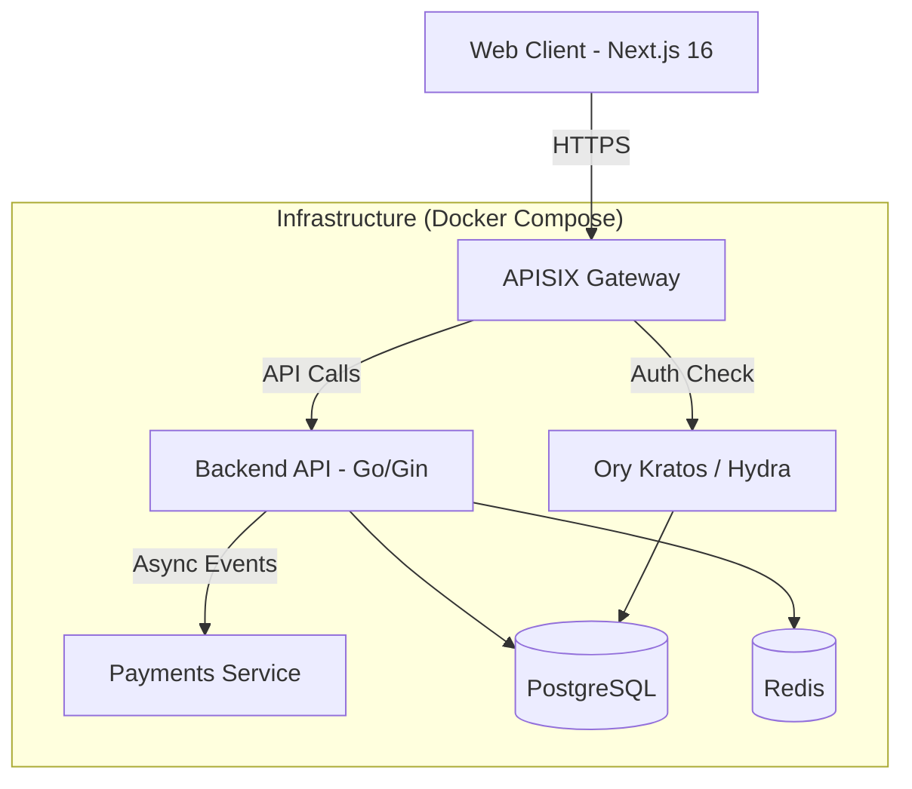

# Arquitetura Técnica do MVP

## Visão Geral da Arquitetura

A arquitetura segue um modelo de microserviços simplificado, adequado para um MVP robusto, focando em separação de responsabilidades (Auth vs Core vs Pagamentos).

## Componentes

### 1. Backend (Core Banking & API)
- **Linguagem:** Go (Golang)
- **Framework:** Gin (Alta performance, minimalista)
- **Responsabilidades:**
  - Gerenciamento de Ledger (livro razão).
  - Orquestração de transações.
  - Exposição de APIs REST/GraphQL para o frontend.
- **Banco de Dados:** PostgreSQL (Transacional, ACID compliance obrigatório).
- **Cache:** Redis (Cache de sessão, rate limiting, distributed locks).

### 2. Autenticação & Identidade
- **Solução:** Ory Stack (Self-hosted via Docker).
  - **Kratos:** Gerenciamento de identidade (Login, Registro, Recuperação, 2FA).
  - **Hydra (Opcional no MVP):** Se necessitar OAuth2 Provider completo.
- **Fluxo:** PKCE + OIDC. O Frontend não toca em senhas diretamente.
- **Gateway:** Apache APISIX para roteamento e validação de tokens antes de chegar aos serviços.

### 3. Frontend (Web App)
- **Stack:** Bun + Next.js 16 (App Router).
- **Estilização:** Tailwind CSS (Recomendado pela velocidade).
- **Integração:** Bibliotecas oficiais do Ory para React/Next.js.

### 4. Infraestrutura & DevOps
- **Containerização:** Docker e Docker Compose para ambiente de desenvolvimento e PoC.
- **Observabilidade:**
  - `docker logs` para ingestão imediata.
  - Prometheus + Grafana (Básico) para métricas de sistema.
  - OpenTelemetry (Futuro) para tracing distribuído.
- **CI/CD:** GitHub Actions (Build, Test, Lint).

### 5. Pagamentos (Microserviço)
- Serviço isolado para lidar com gateways externos (Stripe, Adyen, Banco Central).
- Desenho desacoplado para permitir troca fácil de provedor.
